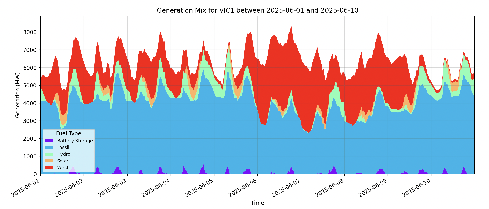
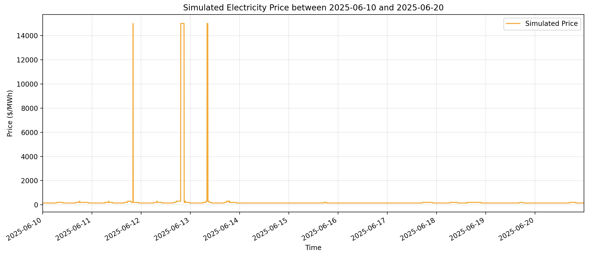
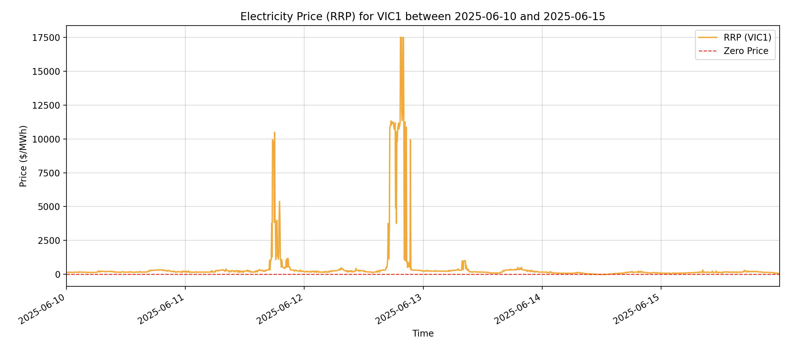
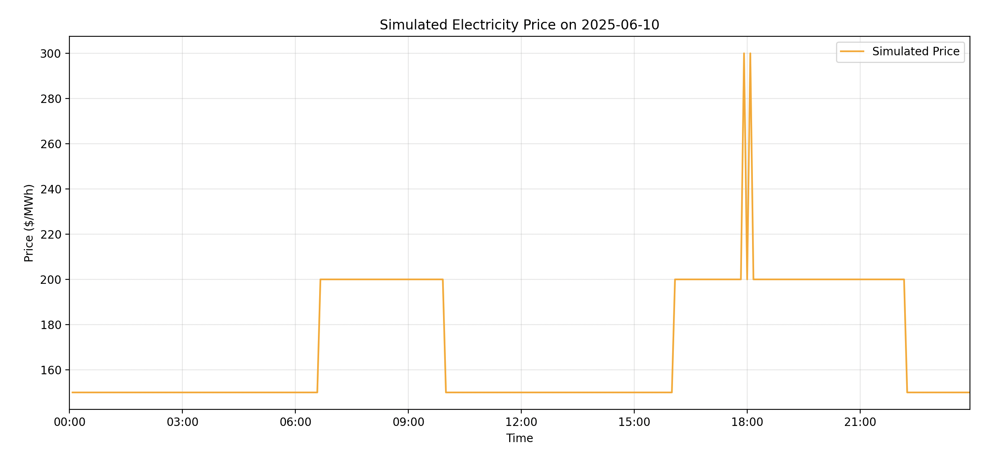
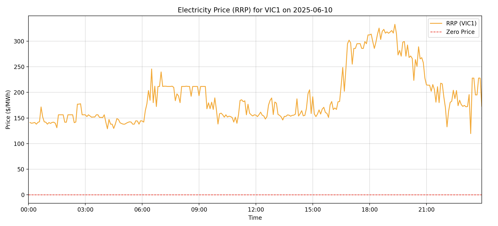

# nem-data-analysis

This project aims to understand the data provided my AEMO in regards to the energy market in Australia using the [NEMOSIS library](https://github.com/UNSW-CEEM/NEMOSIS).

## Solar Sponge - Analysing the average price by hour

The goal is to visualise the price trough caused by solar during the day.

From running the `plot_price` function in the `solar_sponge.py` script, we see that the price drops during the day between 6am to 3pm; this is known as the "duck curve" or the "solar sponge", in which there are an abundant amount of solar power generated during the day and less demand for electricity, leading to a drop in price.

Victoria has a lot of rooftop solar panels installed, meaning that each building are well-sustained during the day, so there is no need to purchase electricity from the grid. [[1]](https://www.solar.vic.gov.au/slashing-energy-bills-record-year-solar)

An interesting observation is that the price drops significantly more during hotter months compared to colder months. For example, on average in January of 2025, the lowest price dropped to -25$/MWh at around 12pm, which means there are so much abundant energy generated that coal and gas generators had to pay the market to take their energy just to stay online (because shutting down and getting them back online costs a lot of money). In contrast, in the winter period such as in August of 2025, the lowest average price is around 20$/MWh at around 12pm and reached up to 200$/MWh at around 6pm; this is because there are less solar energy during winter and people used more electricity in the evening due to the cold weather.

Additionally, if we look at the price by hour in June of 2025, we see that average price actually jumped to about 1000$/MWh at around 6pm. This is not a coincident, and actually tied to three main factors. Firstly, during the early to middle of the month, there was a severe lack of wind power; as Victoria relies a lot on wind energy, this directly impacted the low-cost energy generation and forced the market to relie on coal and gas generation. Secondly, just as the wind stopped blowing, some key coal generators were broken; the Yallourn power station went offline around June 8th due to air duct collapsing [[2]](https://www.abc.net.au/news/2025-06-09/yallourn-power-station-outage-air-duct-collapse/105394406), and in addition, the Loy Yang A power station also went offline further reducing the amount of energy available [[3]](https://leadingedgeenergy.com.au/blog/electricity-market-review-june-2025/#:~:text=In%20June%2C%20an%20air%20duct,unit%20offline%2C%20compounding%20supply%20tightness.). Thirdly, demand spiked as people required heating during winter evenings, worsening the supply-demand gap. Therefore, those three factors lead to a huge average price spike in June of 2025.

## Duck Curve - Analysing the generation mix

The goal is to visualise the generation mix and how it changes on average throughout the day.

From the plots above, we can see a clear correlation between the generation mix and the spot price fluctuation. Looking back at the June 2025 case, in early June (6th to 10th), there was a strong wind power generation, and the RRP between that period were relatively low compared to the period before and after that. In addition, we also see a price jump on the evening of June 12th (entering June 13th), as the wind power was significantly low and since it was during nightime, there was no solar power to cover any loss.

Therefore, to re-emphasise, the generation mix strongly relates to the price of the electricity; that is, renewable energy sources (with no generating cost) can bring the price of electricity down significantly, in contrast, coal and gas generators increase the price as it constantly needs to burn resources to produce electricity.

## Merit-Order - Comparing the theoretical and actual price

The goal is to analyse the theoretical price of electricity generated purely based on the supply and demand, with the price of the last generator dictating the market price.

From the plot above, we see a very clear pattern between the simulated price and the actual price in the time period of June 2025. However, the shape of the price curves highlight the limitation of using fixed marginal costs. The simuated price appears as a rigid staircase curve, whereas the actual price shows alot more fluctuations; this is becuase we assumed that every generator type bids the exact same static price. This discrepency exists because the real-world generators employ strategic bidding by frequently adjusting their price band every 5 minutes based on the competitions and the grid conditions rather than usin a fixed value [[4]](https://www.aemo.com.au/-/media/files/electricity/nem/it-systems-and-change/2017/guide-to-ftp-energy-fcas.pdf?la=en)[[5]](https://www.aemo.com.au/-/media/files/electricity/nem/security_and_reliability/dispatch/policy_and_process/nem-operational-forecasting-and-dispatch-handbook-for-wind-and-solar-generators.pdf). Furthermore, the current simulation assumes no energy lost, but in reality, energy is lost as heat during transmission or conversion. These losses need to be taken into consideration in reality, as outlined by hte Australian Energy Market Committee (AEMC) [[6]](https://www.aemc.gov.au/sites/default/files/2019-03/Fact%20sheet%20marginal%20loss%20factors.pdf). Therefore, for future improvements, we need to incorporate dynamic bidding strategies and take into consideration the transmission losses.
